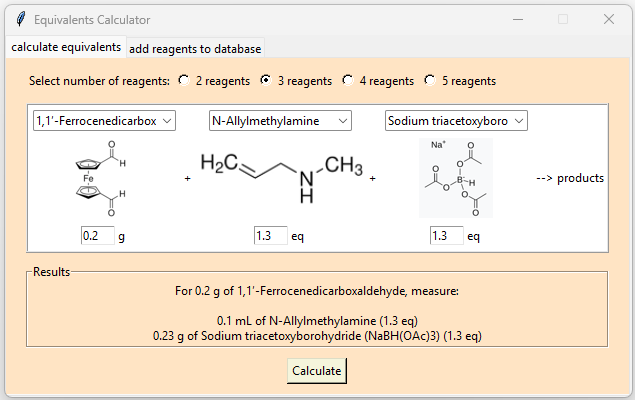
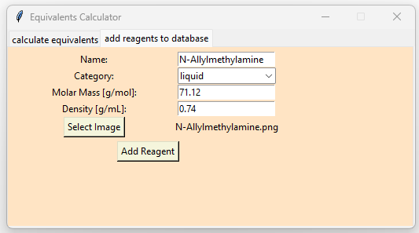

# Description

  
  

This program calculates how much of a particular reagent needs to be measured to set up a chemical reaction based on the initial amount of the starting material (limiting reagent) and the equivalents. The user selects the reagents, enters the initial amount of the first reagent and the equivalents for the rest, then clicks the "Calculate" button. The required amounts for the reaction are displayed in the "Results" window.

To add a reagent to the database (<i>library.json</i>), the user opens the "add to database" tab, fills out the form, and clicks the "Add Reagent" button. Images of the reagents can be added to the <i>images</i> folder. If necessary, the reagent information can always be edited manually in <i>library.json</i>. 
